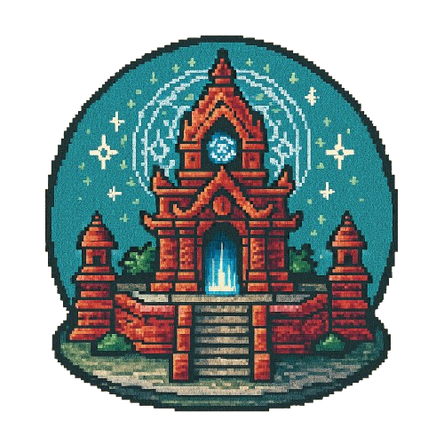
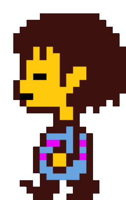
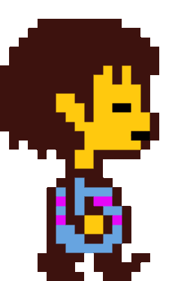
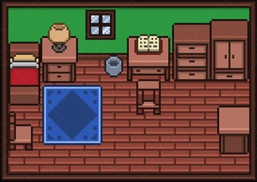
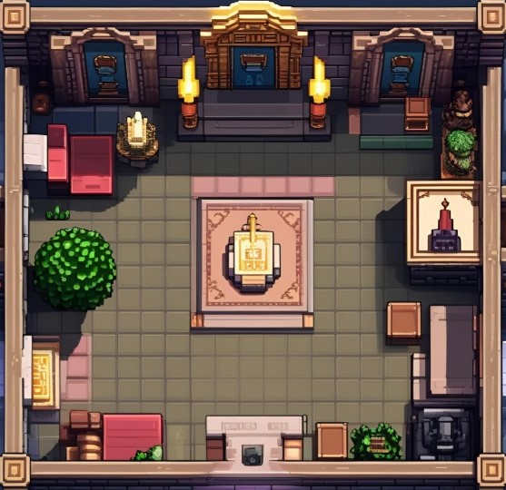
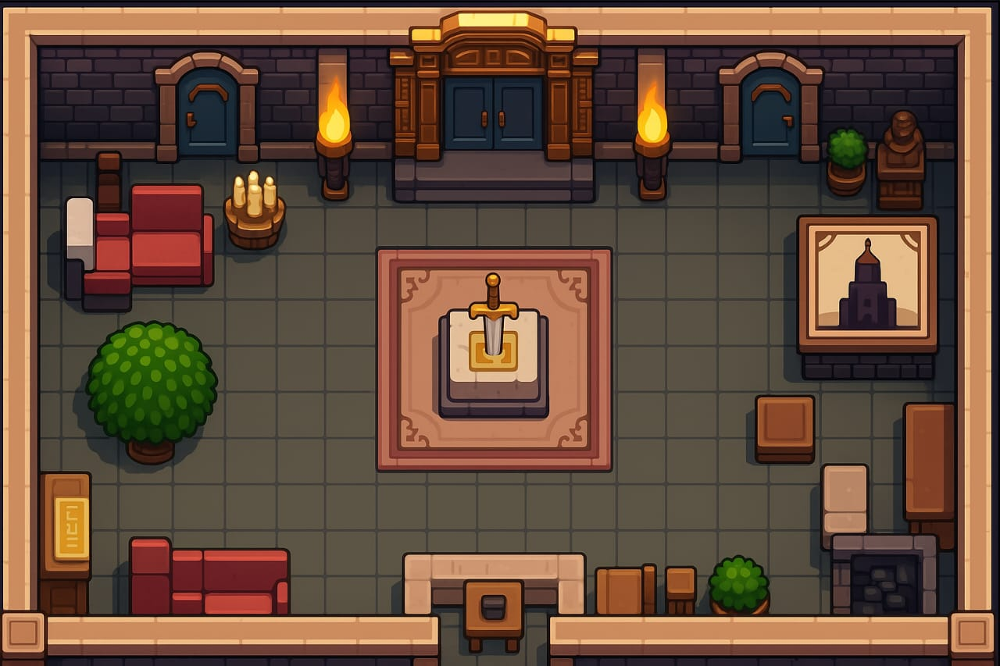
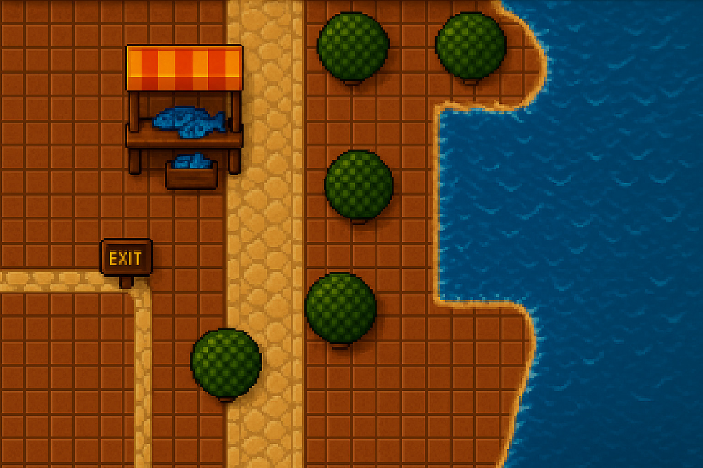
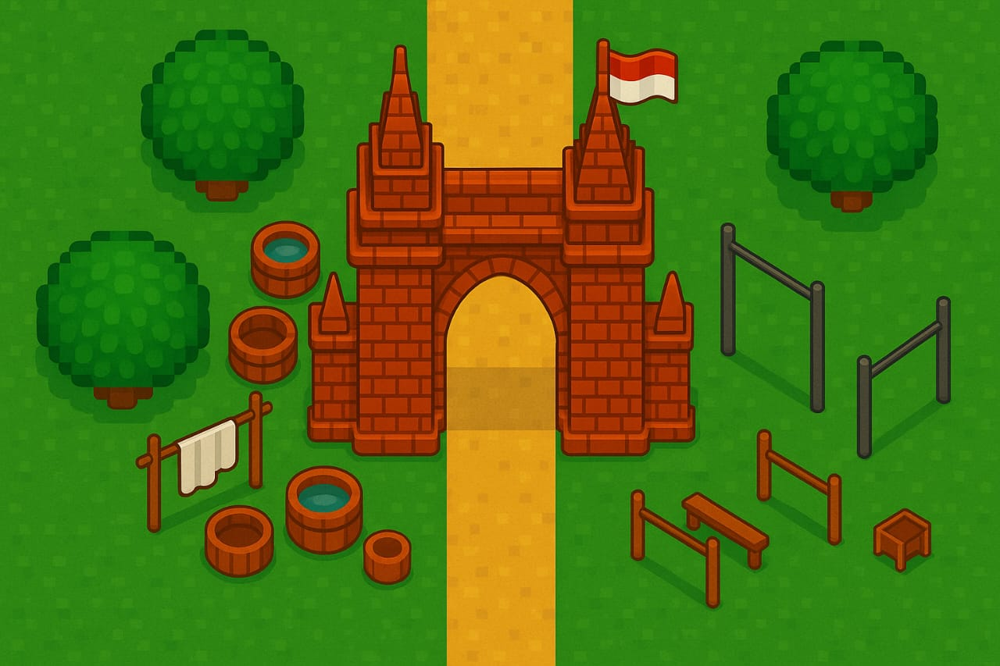

<p align="center">
  
</p>

<h1 align="center">TempleBound</h1>

<p align="center">
  
</p>

> A peaceful journey of survival, exploration, and self-balance.

TempleBound is a browser-based simulation game developed using React.js. Players take control of a wandering character exploring a temple-inspired world while managing essential needs such as food, energy, hygiene, and mood.

The game combines exploration, resource management, and location-based activities into a casual experience where every decision affects the character's well-being. Explore different areas, collect resources, earn money, and survive as long as possible before your status reaches its limit.

---

# About The Project

TempleBound was developed as a web-based simulation game that focuses on exploration and character management rather than combat.

Players must maintain their character's condition by performing activities, collecting resources, and making strategic decisions throughout their journey. Every location offers different opportunities, while every action affects the player's survival.

The project demonstrates how game mechanics such as inventory systems, character stats, animations, map navigation, and state management can be implemented using modern React development practices.

---

# Gameplay Features

## Character Selection

Choose between multiple playable characters before starting your adventure.

Available Characters:

- Chara
- Frisk

Each character features custom sprite animations used throughout the game.

---

## Explore Multiple Locations

Travel between various interconnected areas:

- 🏠 Home
- ⛩️ Temple
- 🏛️ Hall
- 🌊 River Post
- 🚪 Gate

Every location contains unique activities and interactions.

---

## Activity System

Perform different activities to improve your character's condition.

Examples include:

- 😴 Sleeping
- 🍽️ Eating
- 🚿 Bathing
- 🎵 Playing Music
- 🎣 Fishing
- 📖 Reading
- ⚔️ Training
- 🧹 Cleaning

Choosing the right activity at the right time is the key to survival.

---

## Character Status Management

Players must maintain four core attributes:

| Status | Description |
|----------|-------------|
| 🍗 Food | Hunger level |
| ⚡ Energy | Physical stamina |
| 🚿 Hygiene | Cleanliness |
| 🎵 Mood | Emotional condition |

All status values decrease over time.

If any status reaches **0**, the game immediately ends.

---

## Inventory System

Collect and manage useful items throughout your journey.

Available Items:

- 🍎 Apple
- 🥤 Drink
- 🎣 Fish
- 🎵 Music

Items can be used strategically to support survival and improve status values.

---

## Score System

Your final score is determined by:

- Survival Time
- Money Earned

The longer you survive, the better your final result.

---

## Animated Transitions

Moving between locations triggers animated transitions, creating a smoother and more immersive exploration experience.

---

# Gameplay Preview

## 1. Main Menu & Character Selection


---

## 2. Character Design Preview & Sprite Sheets

TempleBound features two playable characters, each equipped with four-direction movement animations used throughout the game world.

These sprite animations were created to support exploration, map navigation, and player immersion.

---

## Chara

<table>
  <tr>
    <td align="center">
      <br>
      <b>Walk Up</b>
    </td>
    <td align="center">
      <br>
      <b>Walk Down</b>
    </td>
    <td align="center">
      <br>
      <b>Walk Left</b>
    </td>
    <td align="center">
      <br>
      <b>Walk Right</b>
    </td>
  </tr>
</table>

Chara serves as one of the playable characters available at the start of the game and utilizes a complete sprite animation set for movement and exploration.

---

## Frisk

<table>
  <tr>
    <td align="center">
      <br>
      <b>Walk Up</b>
    </td>
    <td align="center">
      <br>
      <b>Walk Down</b>
    </td>
    <td align="center">
      <br>
      <b>Walk Left</b>
    </td>
    <td align="center">
      <br>
      <b>Walk Right</b>
    </td>
  </tr>
</table>

Frisk provides an alternative visual style while maintaining the same gameplay mechanics and movement system.

---

## 3. Map Locations

TempleBound features multiple interconnected areas that players can explore. Each location offers unique activities, interactions, and gameplay opportunities.

<table>
  <tr>
    <td align="center">
      <br>
      <b>🏠 Home</b>
    </td>
    <td align="center">
      <br>
      <b>⛩️ Temple</b>
    </td>
  </tr>

  <tr>
    <td align="center">
      <br>
      <b>🏛️ Hall</b>
    </td>
    <td align="center">
      <br>
      <b>🌊 River Post</b>
    </td>
  </tr>

  <tr>
    <td colspan="2" align="center">
      <br>
      <b>🚪 Gate</b>
    </td>
  </tr>
</table>
---

## 4. Activity System


---

## 5. Status Management


---

## 6. Game Over Screen


---

# Tech Stack

## Frontend

- React.js
- Vite
- JavaScript (ES6+)
- CSS3
- Bootstrap 5

## Game Systems

- React State Management
- Component-Based Architecture
- Character Controller System
- Inventory System
- Status Management System
- Timer & Score Tracking
- Multi-Map Navigation

---

# Project Structure

```text
TempleBound/
│
├── public/
│   ├── assets/
│   │   ├── Chara/
│   │   ├── Frisk/
│   │   ├── MapAssets/
│   │   ├── Background2.gif
│   │   ├── Chair.gif
│   │   ├── Fishing.gif
│   │   ├── Read.gif
│   │   ├── shower.gif
│   │   ├── Sword.gif
│   │   ├── tidur.gif
│   │   └── trade.gif
│
├── src/
│   ├── components/
│   │   ├── ControlActivity.jsx
│   │   ├── GameArena.jsx
│   │   ├── GameOverScreen.jsx
│   │   ├── GateMapArena.jsx
│   │   ├── HallMapArena.jsx
│   │   ├── HomeMapArena.jsx
│   │   ├── InventoryModal.jsx
│   │   ├── RiverPostMapArena.jsx
│   │   ├── StartScreen.jsx
│   │   ├── StatusBar.jsx
│   │   ├── TempleMapArena.jsx
│   │   └── Timer.jsx
│   │
│   ├── App.jsx
│   ├── TempleBound.jsx
│   ├── main.jsx
│   └── style.css
│
├── package.json
├── vite.config.js
└── README.md
```

---

# 🚀 Getting Started

## Clone Repository

```bash
git clone https://github.com/yourusername/templebound.git

cd templebound
```

---

## Install Dependencies

```bash
npm install
```

---

## Run Development Server

```bash
npm run dev
```

---

## Build Production Version

```bash
npm run build
```

---

# Development Highlights

During development, several gameplay systems were implemented:

- Character Movement System
- Sprite Animation Handling
- Multi-Map Navigation
- Inventory Management
- Activity-Based Interactions
- Survival Status Mechanics
- Score Calculation System
- Game Over Conditions
- Animated Location Transitions

---

# 💡 Future Improvements

Potential future features include:

- NPC Interactions
- Quest System
- Save & Load Functionality
- Day & Night Cycle
- Weather System
- Achievement System
- Sound Effects
- Background Music
- Additional Playable Characters

---

# What we Learned

Through this project, I gained practical experience in:

- React.js Development
- Vite Project Configuration
- Component-Based Architecture
- State Management
- Game Logic Design
- Character Animation Systems
- UI/UX Design for Games
- Asset Management
- Interactive Web Applications
- Frontend Performance Optimization

---

# CHILL DUDES TEAM

TempleBound is a collaborative game development project created using React.js and Vite.

### Developers

- Sebastian Benaya
- Abthal Akbar
- Stavey Jeremy Lahindah
- Devlin Valentino
- Yehezkiel Winata

---

## Gameplay Walkthrough

Curious about the gameplay experience?

Watch the full walkthrough below:

https://www.youtube.com/watch?v=MTTpdTq95j8

---

# License

This repository is shared for educational, learning, and portfolio purposes.

You are welcome to use the source code as a reference or starting point for your own projects. Modification and further development are encouraged.

---

⭐ If you enjoyed this project, consider giving it a star.